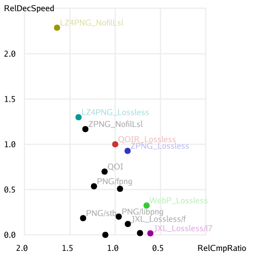

# QOIR: a Simple, Lossless Image File Format

QOIR (pronounced like "choir") is a simple, lossless image file format that is
very fast to encode and decode while achieving compression ratios roughly
comparable to PNG.

**WARNING: THIS FORMAT IS EXPERIMENTAL AND SUBJECT TO INCOMPATIBLE CHANGES.**

It was inspired by the [QOI image file format](https://qoiformat.org/),
building on it in a number of ways:

- It uses a RIFF-like file structure, allowing future extensions.
- That structure means that QOIR files can include metadata like color profiles
  (QOI is limited to two choices, "linear" or "sRGB") and EXIF information.
- It integrates LZ4 compression to [produce smaller
  files](https://github.com/nigeltao/qoir/commit/9be1f2fdcfac3289804b80d4b0673dde499a9c1c).
- It can represent premultiplied alpha (as well as PNG's non-premultiplied
  alpha), which can avoid a post-processing step if your game engine or GUI
  toolkit works with [premultiplied
  alpha](https://iquilezles.org/articles/premultipliedalpha/).
- It has an optional lossy mode.
- It partitions the image into independent tiles, allowing for multi-threaded
  codec implementations.
- As an implementation concern (not a file format concern), it can decode into
  a pre-existing pixel buffer (in a variety of pixel formats), not just always
  returning a newly allocated pixel buffer. This also supports multi-threaded
  decoding, where the entire pixel buffer is allocated first and N separate
  threads then decode into their own separate portion of that pixel buffer.


## Building

[`src/qoir.h`](src/qoir.h) is a single file C library, so there's no separate
configure or build steps. Just `#define QOIR_IMPLEMENTATION` before you
`#include` it.


## Benchmarks

The numbers below are the top-level summary of the full benchmarks, normalized
so that QOIR is 1.000 (the [full benchmarks](doc/full_benchmarks.txt) page has
raw, non-normalized numbers and links to the benchmark suite of images). For
example, **comparing PNG/libpng with QOIR, libpng compresses a little smaller
(0.960 versus 1.000) but QOIR encodes 30x faster (0.033 versus 1.000) and
decodes 4.9x faster (0.203 versus 1.000)**.

For example, PNG/fpng encodes faster (1.138x) than QOIR but produces larger
(1.234x) files and decodes slower (0.536x) than QOIR.

For example, JPEG-XL Lossless at its default encoder options produces smaller
files (0.613x) but encodes slower (0.003x) and decodes slower (0.017x) than
QOIR. Inverting those last two numbers give QOIR encoding 296x faster and
decoding 60x faster than JPEG-XL Lossless (using its "effort = 7" option).

The conclusion isn't that QOIR is always better or worse than any other format.
It's all trade-offs. However, on the full image test suite, **QOIR has the
fastest decode speed listed for PNG-like (or better) compression ratios**. It
can admittedly be faster than QOIR to literally just lz4-compress or
zstd-compress the RGB / RGBA pixel values, but this produces 1.642x or 1.330x
larger files respectively. Conversely, JXL and WebP, lossless or lossy, have
better compression ratios but also slower encode and decode speeds.

**ZPNG "lossless" (the original, upstream ZPNG) is very competitive with and
sometimes strictly better than QOIR**. It occupies a similar spot in the design
space to QOIR: simple implementation, reasonable compression ratio, very fast
encode / decode speeds. "Sometimes strictly better" means that, on some
photographic-heavy subsets of the image test suite (see the [full
benchmarks](doc/full_benchmarks.txt)), ZPNG outperforms QOIR on all three
columns (compression ratio, encoding speed and decoding speed) simultaneously.
ZPNG is in some sense simpler than QOIR (ZPNG is around 700 lines of C++ code
plus a zstd dependency) but in another sense more complicated (because of the
zstd dependency). QOIR is around 3000 lines of C code plus 4000 lines of data
tables, without any further dependencies.

Even though PNG/stb and QOI are worse than QOIR in all three columns, they
still have their own advantages. PNG/stb, like any PNG implementation, has
unrivalled compatibility with other software (and the stb library is easy to
integrate, being a single file C library). QOI is the simplest (easiest to
understand and easiest to customize) format, weighing under 700 lines of C
code, without any further dependencies.

To repeat, it's all trade-offs.


### Lossless Benchmarks

```
Rel = Relative to QOIR_Lossless (which is normalized to 1.000)

RelCmpRatio  = Relative CompressedSize / DecompressedSize. Lower is better.
RelEncSpeed  = Relative Encode MegaPixels per second.     Higher is better.
RelDecSpeed  = Relative Decode MegaPixels per second.     Higher is better.

QOIR_Lossless    1.000 RelCmpRatio    1.000 RelEncSpeed    1.000 RelDecSpeed   (1)

JXL_Lossless/f   0.860 RelCmpRatio    0.630 RelEncSpeed    0.120 RelDecSpeed   (2)
JXL_Lossless/l3  0.725 RelCmpRatio    0.032 RelEncSpeed    0.022 RelDecSpeed
JXL_Lossless/l7  0.613 RelCmpRatio    0.003 RelEncSpeed    0.017 RelDecSpeed
LZ4PNG_Lossless  1.403 RelCmpRatio    1.038 RelEncSpeed    1.300 RelDecSpeed   (3)
LZ4PNG_NofilLsl  1.642 RelCmpRatio    1.312 RelEncSpeed    2.286 RelDecSpeed   (3)
PNG/fpng         1.234 RelCmpRatio    1.138 RelEncSpeed    0.536 RelDecSpeed   (1)
PNG/fpnge        1.108 RelCmpRatio    1.851 RelEncSpeed      n/a RelDecSpeed   (1)
PNG/libpng       0.960 RelCmpRatio    0.033 RelEncSpeed    0.203 RelDecSpeed
PNG/stb          1.354 RelCmpRatio    0.045 RelEncSpeed    0.186 RelDecSpeed   (1)
PNG/wuffs        0.946 RelCmpRatio      n/a RelEncSpeed    0.509 RelDecSpeed   (1), (4)
QOI              1.118 RelCmpRatio    0.870 RelEncSpeed    0.700 RelDecSpeed   (1)
WebP_Lossless    0.654 RelCmpRatio    0.015 RelEncSpeed    0.325 RelDecSpeed
ZPNG_Lossless    0.864 RelCmpRatio    0.747 RelEncSpeed    0.927 RelDecSpeed   (3)
ZPNG_NofilLsl    1.330 RelCmpRatio    0.843 RelEncSpeed    1.168 RelDecSpeed   (3)
```

(1) means that the codec implementation is available as a [single file C
library](https://github.com/nothings/stb/blob/master/docs/stb_howto.txt).

(2) means that the fjxl encoder is a single file C library but there is no fjxl
decoder. There's also the j40 single file JXL decoder, in a separate
repository, but I couldn't get it to work. Passing it something produced by the
cjxl reference encoder produced `Error: Decoding failed (rnge) during
j40_next_frame`.

(3) means that ZPNG (or LZ4PNG) ships as a pair of `.cpp / .h` files, easily
adaptable to a single-ish file C library, but it also introduces a dependency
on the official zstd (or lz4) library.

(4) means that Wuffs' standard library has a PNG decoder but not a PNG encoder.
The "compression ratio" numbers simply take the benchmark suite PNG images "as
is" without re-encoding.

Here's a chart of (single-threaded) relative decode speed versus relative
compression ratio, from the table above. Upwards and rightwards is better. It's
not that encoding speed, code complexity, additional dependencies, multi-thread
friendliness and compatibility with other software aren't important. They're
just not in this chart.




### Lossy Benchmarks

QOIR is first and foremost a lossless format (for 24-bit RGB or 32-bit RGBA
images) but it also has a trivial lossy mode (reducing each pixel from 8 to 6
bits per channel). Here are some comparisons to other lossy formats. Once
again, there are trade-offs.

```
QOIR_Lossy       0.641 RelCmpRatio    0.903 RelEncSpeed    0.731 RelDecSpeed   (1)
JXL_Lossy/l3     0.440 RelCmpRatio    0.051 RelEncSpeed    0.091 RelDecSpeed
JXL_Lossy/l7     0.305 RelCmpRatio    0.013 RelEncSpeed    0.070 RelDecSpeed
LZ4PNG_Lossy2    1.095 RelCmpRatio    0.945 RelEncSpeed    1.251 RelDecSpeed   (5), (3)
WebP_Lossy       0.084 RelCmpRatio    0.065 RelEncSpeed    0.453 RelDecSpeed
WebP_Lossy2      0.443 RelCmpRatio    0.015 RelEncSpeed    0.435 RelDecSpeed   (5)
ZPNG_Lossy2      0.645 RelCmpRatio    0.674 RelEncSpeed    0.898 RelDecSpeed   (5), (3)
```

(5), the Lossy2 suffix, means that the images are encoded losslessly (even
though e.g. WebP does have its own lossy format) but after applying QOIR's
lossiness=2 quantization, reducing each pixel from 8 to 6 bits per channel.

Other lossy encoders (other than QOIR) use the respective libraries' default
options. Different size / speed / quality trade-offs may be achievable with
other options.


### Multi-Threading

The benchmark numbers above are all single-threaded. Other codec
implementations can be sped up (in terms of wall clock time) by using multiple
threads. QOIR is no different: multi-threaded decoding can be [over 3x
faster](https://github.com/nigeltao/qoir/commit/913011d51da68c4f9c3e7c9d98aa4f9a04ac8d8e),
depending on your input image size.


### Other Libraries

These libraries are only used by the benchmark program. The QOIR codec
implementation has no dependencies (and brings its own LZ4 implementation).

JXL ([libjxl/libjxl](https://github.com/libjxl/libjxl)) is the official JPEG-XL
library. The /l suffix denotes the regular libjxl implementation and the /f
suffix denotes the `experimental/fast_lossless` encoder (also known as fjxl) in
that repository (but still using the regular libjxl decoder). The final 3 or 7
denotes libjxl's "effort" encoding option, which defaults to 7.

LZ4PNG is ZPNG (see below) with lz4 instead of zstd compression.

PNG/fpng ([richgel999/fpng](https://github.com/richgel999/fpng)) is a fast PNG
encoder and decoder. The encoded output are valid PNG images but the fpng
decoder only accepts fpng-encoded PNG images. It is not a general PNG decoder.
It's also currently only SIMD-optimized for the x86 CPU family, not ARM.

PNG/fpnge ([veluca93/fpnge](https://github.com/veluca93/fpnge)) is a very fast
PNG encoder. The repository only contains an encoder, not a decoder. It's also
currently only SIMD-optimized for the x86 CPU family, not ARM.

PNG/libpng is the official libpng library as built on Debian Bullseye.

PNG/stb ([nothings/stb](https://github.com/nothings/stb)) is one of the best
known "single file C library" PNG implementations.

PNG/wuffs ([google/wuffs](https://github.com/google/wuffs)) is the PNG decoder
from the Wuffs repository. There is no encoder but the decoder is discussed in
["The Fastest, Safest PNG Decoder in the
World"](https://nigeltao.github.io/blog/2021/fastest-safest-png-decoder.html).
While its reported decode speed here is not as fast as PNG/fpng, PNG/wuffs is a
general PNG decoder and isn't limited to only those PNG images produced by the
PNG/fpng encoder.

QOI ([phoboslab/qoi](https://github.com/phoboslab/qoi)) is a recent (released
in 2021), simple image file format that is remarkably competitive.

QOIR is this repository. Lossless is the default option. Lossy means using the
lossiness=2 encoding option, reducing each pixel from 8 to 6 bits per channel.

WebP is the official libwebp library as built on Debian Bullseye. The WebP file
format cannot represent an image dimension greater than 16383 pixels, such as
the 1313 x 20667 `screenshot_web/phoboslab.org.png` image from the benchmark
suite. For these large images, we use PNG/libpng instead.

ZPNG [catid/Zpng](https://github.com/catid/Zpng) is a simple, experimental,
lossless image format that combines the zstd compression codec with PNG-style
filtering. This repository adapts that third-party code to also create "lossy"
(with QOIR's lossiness=2 quantization) and "no-filter lossless" (literally just
zstd-compressed RGB / RGBA values) variants.


### Excluded Libraries

AVIF wasn't measured. I gave up after hitting [Debian bug
976349](https://bugs.debian.org/cgi-bin/bugreport.cgi?bug=976349) and the
combination of (1) lossless is the primary focus of QOIR but (2) the [avif
examples](https://github.com/AOMediaCodec/libavif/tree/b3e0f31/examples) or
avif.h file not obviously showing how to encode *losslessly* from the library
(not the command line tools). Maybe I'll try again later.

[ImageZero](https://github.com/cfeck/imagezero) wasn't measured. Around 45% of
the [benchmark suite images](https://qoiformat.org/benchmark/) have an alpha
channel, which ImageZero cannot represent.

JPEG wasn't measured, for the same "cannot represent alpha" reason.

[MarcioPais/SIF](https://github.com/MarcioPais/SIF), "Simple Image Format",
wasn't measured, for the same "cannot represent alpha" reason.

PNG/libspng and PNG/lodepng weren't measured. They are presumably roughly
comparable, [within a factor of
2](https://nigeltao.github.io/blog/2021/fastest-safest-png-decoder.html#appendix-benchmark-numbers),
to PNG/libpng and PNG/stb.


## LZ4

The LZ4 block compression implementation in this repository is available as a
stand-alone [Single File LZ4 C Library](https://github.com/nigeltao/sflz4).

You can instead subset just the `lz4.c` and `lz4.h` files from the [official
lz4 library](https://github.com/lz4/lz4/tree/dev/lib), if you don't mind having
two files.

[smalllz4](https://create.stephan-brumme.com/smallz4/) is another alternative.


## License

Apache 2. See the [LICENSE](LICENSE) file for details.


---

Updated on December 2022.
